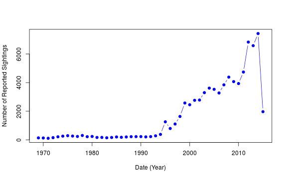
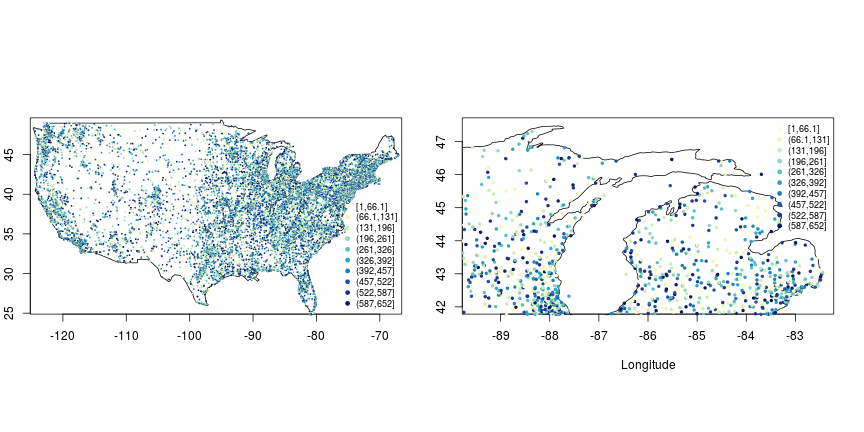
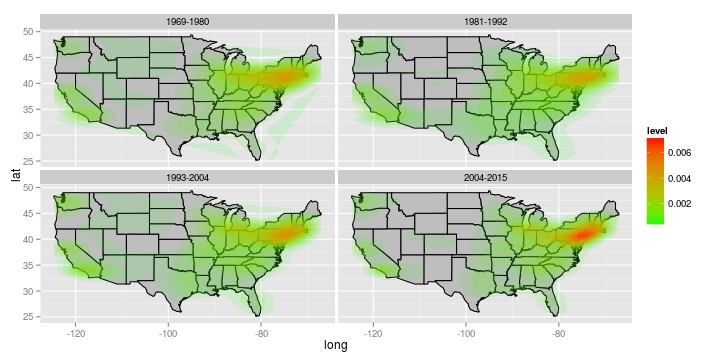

## The National UFO Resource Center
The [NUFORC](http://nuforc.org) is an organization "Dedicated to the Collection and Dissemination of Objective UFO Data" 

This raised the following questions:
  1.  Are there hotspots of UFO sightings?
  2.  How have sighting reports changed over time?

The NUFORC DB has:
  78451 records spanning the dates: 1969-01-01, 2015-06-06 for the US. With ~20,000 more sightings reported around the world.

--- .class #id 

## UFO sightings over the last 45 years

It appears that the incidence of UFO reporting has been exponentially increasing as the internet gained popularity and became commonplace.

--- .class #id

## Geographical distribuition of sightings across the US

Aggregate sightings plotted across the US (left) and my home state (Michigan, right). Due to some geocoding constraints Version 1 of the app only covers the USA. Future releases will make use of the google map's API (need to workaaround the query limit). The top plot shows the aggregate sighting counts over the duration of the database at each uniquely identified locale.

--- .class #id

## Sightings by Location by Year

If we break up sightings by decade we see that the more populated areas always tend to have the most reported sightings... Whether this is because extra-terrestrial races are drawn to the bright lights and dense population or some other confounding factor remains to be explored.

--- .class #id
